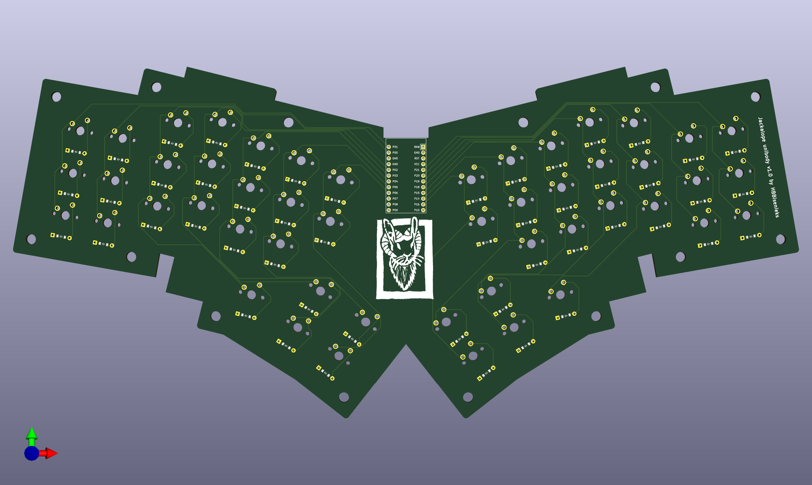
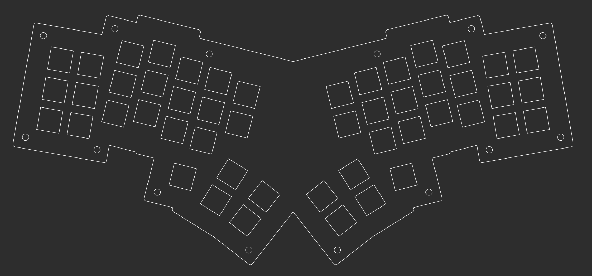

# Jackalope Keyboard
A 50-key ergonomic ~(currently single-piece)~ single-piece or split column-staggered keyboard ~(with a split version planned for the future???)~ inspired by the Absolem, Kryia, and Iris.

The Jackalope layout is focussed on maximizing comfort for the thumbs and reducing reach for the fingers.

## Images of first-generation monoblock PCB and Layout

Built using [Ergogen](https://ergogen.xyz/#).
